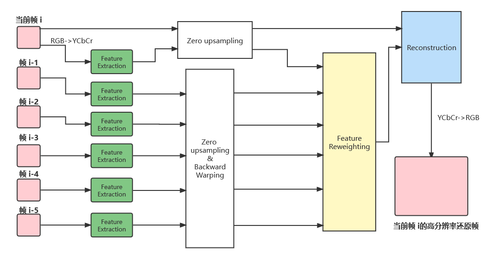
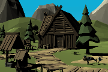
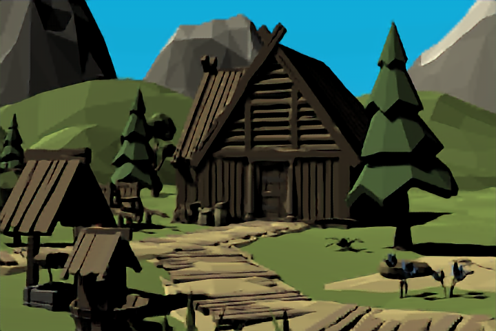

# Neural Supersampling for Real-time Rendering with Pytorch

Create super-resolution images from low-resolution in real time. Non-official implementation of the paper [NSRR](https://research.fb.com/wp-content/uploads/2020/06/Neural-Supersampling-for-Real-time-Rendering.pdf) by Facebook Reality Labs in 2020. A [blog post](https://research.fb.com/blog/2020/07/introducing-neural-supersampling-for-real-time-rendering/) is available with more details.

This work is based on the  [IMAC-projects/NSRR-PyTorch](https://github.com/IMAC-projects/NSRR-PyTorch) , and complete the whole function by myself, to main work I do is to organize the whole network and made some adjustments in the original code.

<center></center>


## Environment

You need Python at least 3.5 (3.6 recommended).

To install other dependencies, you can use pip with :

```bash
pip install -r requirements.txt
```


## Usage

### Dataset

We generate the dataset by unity, if you want to get the access to our generated dataset, you can download bellow.


| Dataset |  Type | Link |
|---------|--------|------|
| 217-Images | Train | [Download](https://jbox.sjtu.edu.cn/l/610oOe) |
| 72-Images | Test | [Download](https://jbox.sjtu.edu.cn/l/Z1or09) |


In order to be loaded using `NSRRDataLoader`, the dataset should be structured like so:

```
[data]
│
└───View
│   │   img_1.png
│   │   img_2.png
│    ...
│   
└───Depth
│   │   img_1.png
│   │   img_2.png
│    ...
│   
└───Motion
│   │   img_1.png
│   │   img_2.png
│    ...
```

Where `root_dir` is the `data_dir` in `config.json` of `NSRRDataLoader`

**Note that corresponding tuples of (view, depth, motion) images files should share the same name, as they cannot be grouped together otherwise.**


### Train

You can remove `-d 1` if you do not have a CUDA-capable GPU.

```bash
python train.py -c config.json -d 1
```

Specially, you can change the upsampling scale by modify the `downscale_factor` in `config.json`.


### Test

Here are two pre-trained models (NSRRmodel-2 is trained only in wooden house scene, so it can only test responding scene image)：

| Model | Scale | Link |
|-------|-------|------|
| NSRRmodel-2 | 2 | [Download](https://jbox.sjtu.edu.cn/l/6105KR) |
| NSRRmodel-4 | 4 | [Download](https://jbox.sjtu.edu.cn/l/J1u3jU) |


 the result will be store in the `output_test` folder (you can modify the storage path )

```
python test.py -c config.json -r /path/to/checkpoint
```


### Result

We calculate the PSNR and SSIM of the supersampling images of different methods: 


| Eval. Mat | Scale | SRCNN | FSRCNN |RDN |SRDenseNet | NSRR (ours)|
|-----------|-------|-------|----------|-------|-----------|--------------|
| PSNR (dB) | 2 | 30.91 | 31.34 | 33.93 | 32.72 | 32.21 |
| SSIM | 2 | 0.943 | 0.950 | 0.973 | 0.961 | 0.963 |
| PSNR (dB) | 4 | 28.47 | 28.82 | 32.02 | 31.09 | 31.01 |
| SSIM | 4 | 0.852 | 0.830 | 0.928 | 0.918 | 0.922 |

<table>
    <tr>
        <td><center>Input(180*120)</center></td>
        <td><center>SRCNN(720*480)</center></td>
        <td><center>NSRR (ours,720*480)</center></td>
    </tr>
    <tr>
    	<td>
    		<center></center>
    	</td>
    	<td>
    		<center></center>
    	</td>
    	<td>
    		<center></center>
    	</td>
    </tr>
</table>


### Miscellaneous information

Using :

* Pytorch project template at:
  https://github.com/victoresque/pytorch-template

* Pytorch implementation of SSIM:
  https://github.com/Po-Hsun-Su/pytorch-ssim

* Pytorch implementation of colour-space conversions:
  https://github.com/jorge-pessoa/pytorch-colors
